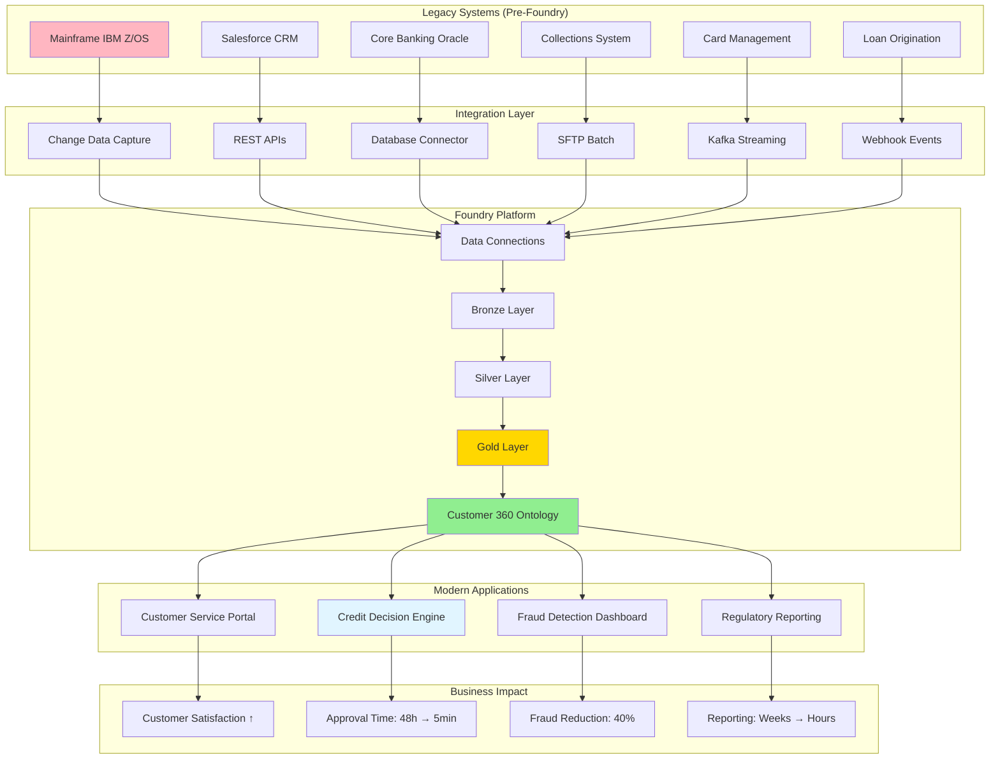
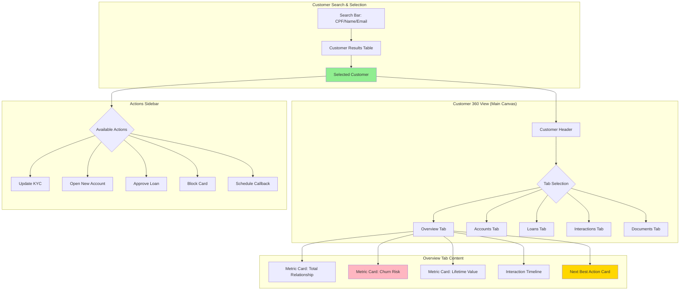
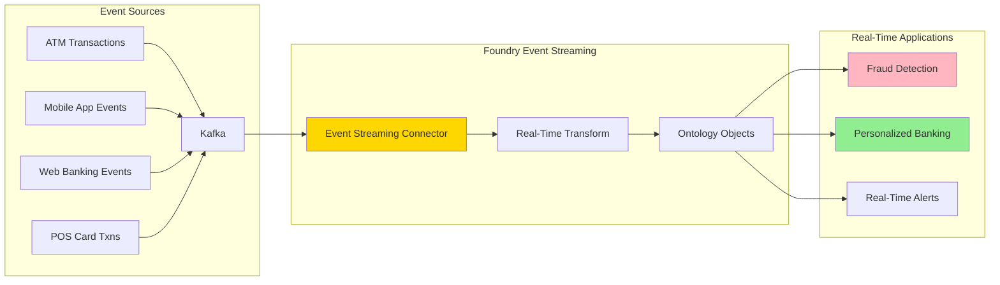
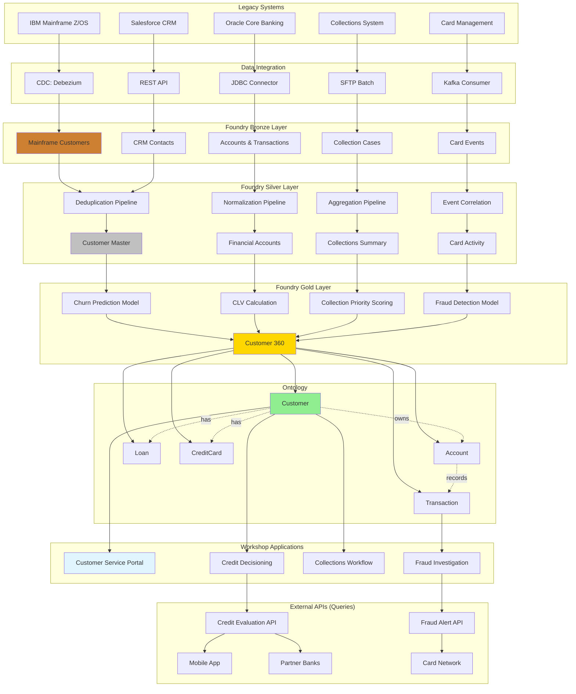

# Caso de Uso: Banco BV - Digital Transformation Journey

## Contexto Empresarial

**Banco BV** (antigo Banco Votorantim) e um banco brasileiro focado em financiamento de veiculos, credito pessoal e digital banking. Com a transformacao digital acelerada pelo COVID-19, o BV precisava:

1. **Modernizar legacy systems** de mainframe IBM para cloud-native
2. **Customer 360 view** unificando dados de 15+ sistemas
3. **Digital-first experience** competindo com fintechs
4. **Real-time decisioning** para credito e fraud prevention

## Desafios Pre-Foundry

### Legacy Modernization
- **Mainframe IBM Z/OS**: 40+ anos de codigo COBOL
- **Batch processing**: Decisoes de credito levavam 24-48h
- **Monolithic architecture**: Mudancas exigiam meses de desenvolvimento
- **Technical debt**: 60% do orcamento de TI em manutencao

### Customer Data Fragmentation
- **15 sistemas desconectados**: CRM, Core Banking, Collections, Cards, Loans
- **Nenhuma visao unificada**: Cada canal via dados diferentes do mesmo cliente
- **Duplicate records**: 23% dos clientes tinham multiplos cadastros
- **Poor CX**: Cliente ligava para call center que nao via historico digital

### Compliance e Risk
- **Manual KYC**: Onboarding levava 5-7 dias
- **Static risk models**: Nao capturavam mudancas comportamentais
- **Regulatory reporting**: Equipes manuais compilando dados por semanas

## Solucao Foundry

### Arquitetura de Transformacao



### 1. Customer 360 Implementation

#### Ontology Design

```typescript
// Customer Object Type (Single Source of Truth)
interface Customer {
    // Identity
    customerId: string;              // Primary key (CPF)
    customerName: string;            // Title
    email: string;
    phone: string;
    dateOfBirth: Date;

    // KYC & Compliance
    kycStatus: "PENDING" | "APPROVED" | "REJECTED";
    kycDate: Date;
    riskRating: "LOW" | "MEDIUM" | "HIGH";
    pep: boolean;                    // Politically Exposed Person
    sanctionsList: boolean;

    // Relationships (Links)
    accounts: Array<Account>;
    loans: Array<Loan>;
    cards: Array<CreditCard>;
    transactions: Array<Transaction>;
    interactions: Array<CustomerInteraction>;

    // Calculated Properties
    totalRelationship: number;       // Sum of all balances
    lifetimeValue: number;           // Predicted CLV
    churnRisk: number;               // ML prediction 0-1
    nextBestAction: string;          // AIP recommendation

    // Audit
    createdDate: Date;
    lastUpdated: Date;
    updatedBy: string;
}

// Account Object Type
interface Account {
    accountId: string;
    accountType: "CHECKING" | "SAVINGS" | "INVESTMENT";
    balance: number;
    status: "ACTIVE" | "DORMANT" | "CLOSED";
    openDate: Date;
    branch: string;
}

// Loan Object Type
interface Loan {
    loanId: string;
    loanType: "AUTO" | "PERSONAL" | "MORTGAGE";
    principalAmount: number;
    outstandingBalance: number;
    interestRate: number;
    installmentAmount: number;
    nextDueDate: Date;
    delinquencyDays: number;
    collateral?: Vehicle;            // For auto loans
}

// CreditCard Object Type
interface CreditCard {
    cardId: string;
    cardNumber: string;              // Masked
    creditLimit: number;
    availableCredit: number;
    utilizationPct: number;
    paymentDueDate: Date;
    minimumPayment: number;
}
```

#### Pipeline: Customer Data Integration

```python
# Bronze → Silver: Customer Master Data
@transform(
    output=Output("/BV/Silver/Customer_Master"),
    mainframe=Input("/BV/Bronze/Mainframe_Customers"),
    crm=Input("/BV/Bronze/Salesforce_Contacts"),
    digital=Input("/BV/Bronze/Digital_App_Users")
)
def create_customer_master(mainframe, crm, digital):
    # Deduplication logic
    # Priority: Digital App > CRM > Mainframe (most recent wins)

    customers_dedup = (mainframe
        .join(crm, mainframe.cpf == crm.cpf, "full_outer")
        .join(digital, coalesce(mainframe.cpf, crm.cpf) == digital.cpf, "full_outer")
        .select(
            coalesce(digital.cpf, crm.cpf, mainframe.cpf).alias("customer_id"),
            coalesce(digital.name, crm.name, mainframe.name).alias("customer_name"),
            coalesce(digital.email, crm.email, mainframe.email).alias("email"),
            coalesce(digital.phone, crm.phone, mainframe.phone).alias("phone"),
            # ... more fields with precedence
        )
        .dropDuplicates(["customer_id"])
    )

    return customers_dedup

# Silver → Gold: Enrich with ML predictions
@transform(
    output=Output("/BV/Gold/Customer_360"),
    customer_master=Input("/BV/Silver/Customer_Master"),
    transactions=Input("/BV/Silver/Transactions_Aggregated"),
    interactions=Input("/BV/Silver/Customer_Interactions")
)
def enrich_customer_360(customer_master, transactions, interactions):
    # Calculate total relationship value
    relationship_value = (transactions
        .groupBy("customer_id")
        .agg(sum("balance").alias("total_relationship"))
    )

    # ML predictions (from externally trained models)
    from pyspark.ml import PipelineModel
    churn_model = PipelineModel.load("/BV/Models/Churn_Prediction_v2")

    enriched = (customer_master
        .join(relationship_value, "customer_id")
        .transform(lambda df: churn_model.transform(df))
        .withColumnRenamed("prediction", "churn_risk")
    )

    return enriched
```

#### Workshop: Customer Service Portal



**Key Features:**

1. **Real-time Data**: Customer balance updates em <5 segundos de transacao
2. **360 Degree View**: Todos produtos, transacoes, interacoes em um lugar
3. **AIP Next Best Action**: LLM recomenda oferta/acao baseado em contexto
4. **Document Viewer**: Contratos, IDs, comprovantes (Media Sets)
5. **Interaction History**: Call center logs, branch visits, app sessions

**TypeScript Functions:**

```typescript
// Helper: Calculate customer health score
@Function()
public calculateCustomerHealth(
    customer: Customer
): HealthScore {
    let score = 100;

    // Deduct for delinquency
    const delinquentLoans = customer.loans.filter(l => l.delinquencyDays > 0);
    score -= delinquentLoans.length * 15;

    // Deduct for low engagement
    const daysSinceLastInteraction =
        (Date.now() - customer.interactions[0]?.date.getTime()) / (1000 * 60 * 60 * 24);
    if (daysSinceLastInteraction > 90) score -= 20;

    // Deduct for high utilization
    const avgUtilization = customer.cards
        .map(c => c.utilizationPct)
        .reduce((a, b) => a + b, 0) / customer.cards.length;
    if (avgUtilization > 80) score -= 10;

    return {
        score: Math.max(0, score),
        category: score >= 80 ? "EXCELLENT" :
                  score >= 60 ? "GOOD" :
                  score >= 40 ? "FAIR" : "POOR",
        factors: {
            delinquency: delinquentLoans.length,
            engagement: daysSinceLastInteraction,
            creditUtilization: avgUtilization
        }
    };
}

// Action: Update KYC Status
@Edits(Customer)
@OntologyEditFunction()
public updateKycStatus(
    customer: Customer,
    newStatus: "APPROVED" | "REJECTED",
    reviewedBy: string,
    notes: string
): void {
    customer.kycStatus = newStatus;
    customer.kycDate = new Date();
    customer.lastUpdated = new Date();
    customer.updatedBy = reviewedBy;

    // Create audit log entry
    const audit = Objects.create.auditLog(Uuid.random());
    audit.entityType = "CUSTOMER";
    audit.entityId = customer.customerId;
    audit.action = "KYC_UPDATE";
    audit.oldValue = customer.kycStatus;
    audit.newValue = newStatus;
    audit.performedBy = reviewedBy;
    audit.notes = notes;
    audit.timestamp = new Date();
}
```

**Resultados:**
- Customer service resolution time: 15min → 3min
- Data accuracy: 77% → 98.5%
- Cross-sell conversion: 3% → 12%
- NPS: 52 → 78

### 2. Real-Time Credit Decisioning

#### Legacy vs Foundry

**ANTES (Mainframe Batch):**
```
Customer applies → Data collected → Batch job overnight →
Credit bureau query → Manual review → Decision (48h)
```

**DEPOIS (Foundry Real-Time):**
```
Customer applies → API call to Foundry Query →
Instant data retrieval + ML scoring → Decision (30sec)
```

#### Implementation

**Query Function (Exposed API):**

```typescript
@Query({ enableQueries: true })
public evaluateCreditApplication(
    cpf: string,
    loanType: "AUTO" | "PERSONAL",
    requestedAmount: number
): CreditDecision {
    // Get customer from Ontology
    const customer = Objects.get.customer(cpf);

    // Check existing relationship
    const existingCustomer = customer !== null;
    const totalExposure = existingCustomer ?
        customer.loans.reduce((sum, loan) => sum + loan.outstandingBalance, 0) : 0;

    // Call credit bureau (external API via Data Connection)
    const bureauScore = callCreditBureau(cpf);

    // ML model prediction
    const defaultRisk = predictDefaultRisk({
        bureauScore: bureauScore,
        existingExposure: totalExposure,
        requestedAmount: requestedAmount,
        customerTenure: existingCustomer ?
            (Date.now() - customer.createdDate.getTime()) / (1000 * 60 * 60 * 24 * 365) : 0
    });

    // Decision rules
    const approved = (
        bureauScore >= 600 &&
        defaultRisk < 0.15 &&
        totalExposure + requestedAmount < calculateMaxExposure(customer)
    );

    return {
        decision: approved ? "APPROVED" : "REJECTED",
        approvedAmount: approved ? requestedAmount : 0,
        interestRate: approved ? calculateRate(bureauScore, defaultRisk) : null,
        reason: !approved ? generateRejectionReason(bureauScore, defaultRisk) : null,
        confidence: 1 - defaultRisk,
        processedInMs: 450
    };
}
```

**Integration with Digital App:**

```javascript
// React Native mobile app
async function submitLoanApplication(loanData) {
    const response = await fetch('https://foundry.bancobv.com.br/api/query/evaluateCreditApplication', {
        method: 'POST',
        headers: {
            'Authorization': `Bearer ${authToken}`,
            'Content-Type': 'application/json'
        },
        body: JSON.stringify({
            cpf: user.cpf,
            loanType: loanData.type,
            requestedAmount: loanData.amount
        })
    });

    const decision = await response.json();

    if (decision.decision === 'APPROVED') {
        navigation.navigate('LoanOffer', { decision });
    } else {
        navigation.navigate('ApplicationRejected', { reason: decision.reason });
    }
}
```

**Resultados:**
- Approval time: 48h → 30 segundos
- Application completion rate: 45% → 82%
- Cost per decision: R$12 → R$0.50
- Default rate: 8.2% → 6.1% (better risk selection)

### 3. Event Streaming Integration (Roadmap Item)

**Planned Architecture:**



**Use Cases:**
- Fraud detection com latencia <1 segundo
- Real-time personalization no app (ofertas baseadas em contexto)
- Instant notifications para transacoes suspeitas

## Metricas de Transformacao

| Dimensao | Pre-Foundry | Post-Foundry | Delta |
|----------|-------------|--------------|-------|
| **Customer Service** | | | |
| Resolution Time | 15min | 3min | -80% |
| Data Accuracy | 77% | 98.5% | +28% |
| NPS Score | 52 | 78 | +50% |
| Cross-sell Rate | 3% | 12% | +300% |
| **Credit Operations** | | | |
| Approval Time | 48h | 30sec | -99.9% |
| Application Completion | 45% | 82% | +82% |
| Cost per Decision | R$12 | R$0.50 | -96% |
| Default Rate | 8.2% | 6.1% | -26% |
| **Technical** | | | |
| Systems Integrated | 1 (Mainframe) | 15 | +1400% |
| Data Latency | 24h (batch) | <5sec | -99.9% |
| Development Time | 6 months | 2 weeks | -92% |
| Infrastructure Cost | - | -40% | -40% |

## Arquitetura Tecnica Detalhada



## Licoes Aprendidas

### Sucessos
1. **Incremental Migration**: Nao tentamos migrar tudo de uma vez, comecamos com Customer 360
2. **API-First**: Expor Foundry via APIs permitiu integrar com sistemas existentes gradualmente
3. **Business Value Focus**: Priorizamos use cases com ROI claro (credit decisioning)
4. **Training Investment**: 40h de training por usuario garantiu adoption

### Desafios
1. **Mainframe Integration**: CDC do mainframe foi complexo, exigiu especialistas IBM
2. **Data Quality**: 6 meses limpando dados antes de ir para producao
3. **Performance**: Materializacoes necessarias para Customer 360 com milhoes de objects
4. **Organizational Change**: Resistencia de areas que perderam controle de dados

### Recomendacoes
- Comece com use case de alto valor e visibilidade (Customer 360 foi perfeito)
- Invista em Data Quality desde dia 1 (Bronze layer e crucial)
- Crie equipe multidisciplinar (Negocio + IT + Data Science)
- Event Streaming para futuros use cases (latencia e chave)

## Roadmap 2025-2026

### Q1 2025: Event Streaming
- Kafka integration completa
- Real-time fraud detection
- Sub-second credit decisions

### Q2 2025: AIP Expansion
- Chatbot com RAG para customer service
- Automated document processing (contratos, IDs)
- LLM-powered collections scripts

### Q3 2025: Advanced Analytics
- Propensity models para upsell/cross-sell
- Dynamic pricing para emprestimos
- Predictive churn prevention

### Q4 2025: Ecosystem Expansion
- Open Banking API integration
- Partner marketplace (seguros, investimentos)
- Data monetization (anonimizado para terceiros)

## Contato

Para mais informacoes sobre transformacao digital em bancos:

- [BTG Pactual Case](./btg-pactual.md) - Compliance e cybersecurity
- [Natura Brasil Case](./natura-brasil.md) - Supply chain
- [Overview de Casos Brasileiros](./overview.md) - Padroes comuns

---

**Documento preparado por**: Equipe Ontologize
**Ultima atualizacao**: Novembro 2025
**Status**: Producao (Customer 360 desde Q4 2024, Credit Decisioning desde Q1 2025)
