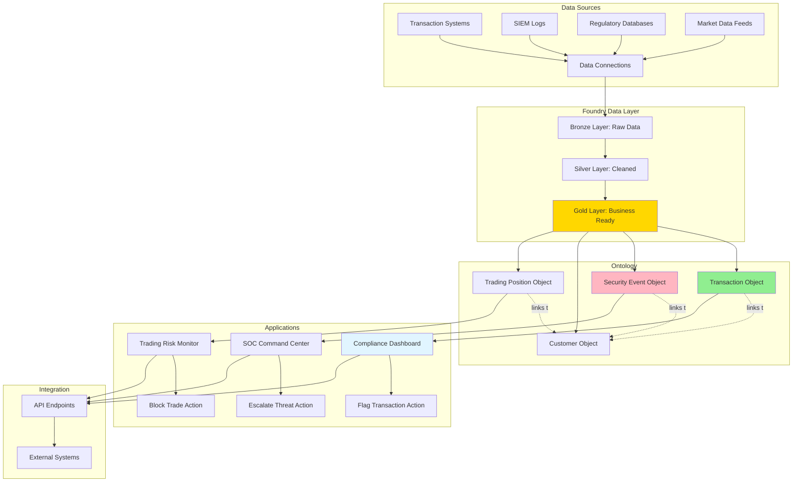
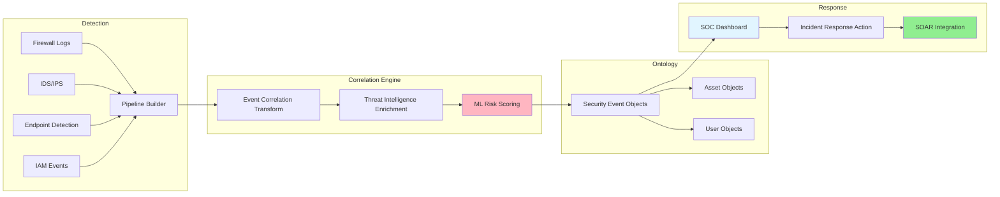
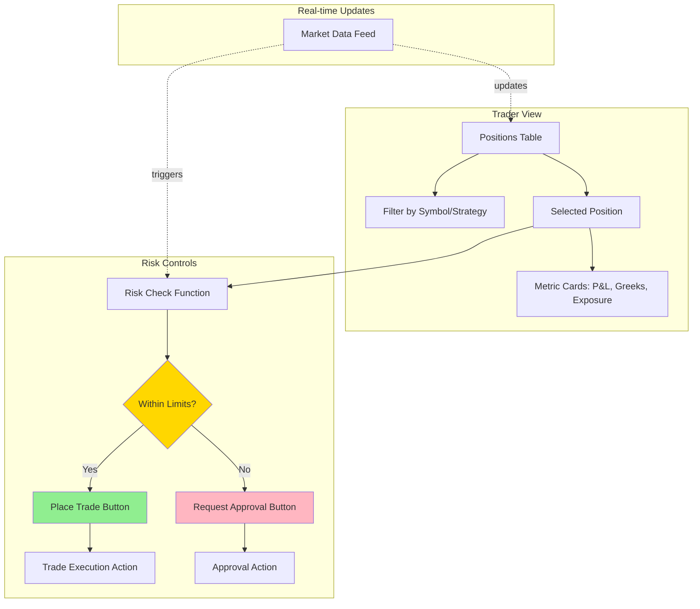
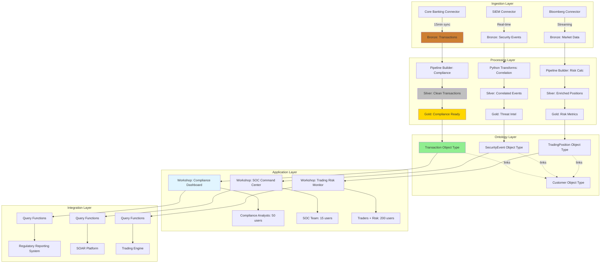

# Caso de Uso: BTG Pactual - Compliance e Cybersecurity

## Contexto Empresarial

**BTG Pactual** e o maior banco de investimentos da America Latina, com operacoes em wealth management, investment banking, corporate lending e asset management. Com a crescente complexidade regulatoria no Brasil (LGPD, regulacoes do Banco Central) e ameacas de cybersecurity em constante evolucao, o banco precisava de uma plataforma integrada para:

1. **Automatizar compliance** em tempo real
2. **Monitorar cybersecurity** proativamente
3. **Integrar retail trading operations** com controles de risco

## Desafios Pre-Foundry

### Compliance Manual e Fragmentado
- Revisoes manuais de transacoes suspeitas (demora de 48-72h)
- Dados de compliance espalhados em 15+ sistemas legados
- Falta de single source of truth para regulamentos
- Relatorios para reguladores levavam semanas para compilar

### Cybersecurity Reativa
- Deteccao de ameacas baseada em regras estaticas
- Alertas de seguranca nao priorizados (90% falsos positivos)
- Sem correlacao entre eventos de diferentes fontes
- Incident response manual e lento

### Retail Trading Silos
- Plataforma de trading desconectada de risk management
- Limites de exposicao atualizados apenas diariamente
- Cliente experience comprometida por delays em aprovacoes

## Solucao Foundry

### Arquitetura de Implementacao



### 1. Compliance Automation

#### Pipeline de Dados
```python
# Bronze → Silver: Limpeza de transacoes
@transform(
    output=Output("/BTG/Silver/Transactions_Clean"),
    transactions=Input("/BTG/Bronze/Core_Banking_Txns")
)
def clean_transactions(transactions):
    return (transactions
        .filter(col("amount").isNotNull())
        .withColumn("risk_score", calculate_risk_score(
            col("amount"),
            col("counterparty_country"),
            col("customer_segment")
        ))
        .withColumn("requires_review",
            when(col("risk_score") > 75, True).otherwise(False))
    )

# Silver → Gold: Enriquecimento com dados regulatorios
@transform(
    output=Output("/BTG/Gold/Transactions_Enriched"),
    clean_txns=Input("/BTG/Silver/Transactions_Clean"),
    sanctions_list=Input("/BTG/Reference/OFAC_Sanctions")
)
def enrich_with_compliance(clean_txns, sanctions_list):
    return (clean_txns
        .join(sanctions_list,
              clean_txns.counterparty_id == sanctions_list.entity_id,
              "left")
        .withColumn("sanctions_match",
            when(sanctions_list.entity_id.isNotNull(), True).otherwise(False))
    )
```

#### Workshop Application: Compliance Dashboard

**Object Types Criados:**
- `Transaction` (70M+ objects)
- `Customer` (2M+ objects)
- `RegulatoryRule` (500+ objects)
- `ComplianceCase` (50K+ objects)

**Widgets Principais:**
1. **Metric Cards**: Transacoes pendentes review, casos abertos, SLA compliance
2. **Filter List**: Por risk score, tipo de transacao, geografia, periodo
3. **Object Table**: Transacoes ordenadas por prioridade com drill-down
4. **Button Group**: "Flag for Review", "Approve", "Escalate to Regulator"

**Action Types:**
```typescript
@Edits(Transaction, ComplianceCase)
@OntologyEditFunction()
public flagTransaction(
    txn: Transaction,
    reason: string,
    analyst: string
): void {
    // Criar caso de compliance
    const complianceCase = Objects.create.complianceCase(Uuid.random());
    complianceCase.transactionId = txn.id;
    complianceCase.flagReason = reason;
    complianceCase.assignedAnalyst = analyst;
    complianceCase.createdDate = new Date();
    complianceCase.status = "OPEN";

    // Atualizar transacao
    txn.complianceStatus = "UNDER_REVIEW";
    txn.reviewedBy = analyst;
}
```

**Resultados:**
- Tempo de revisao: 72h → 4h (95% reducao)
- False positives: 90% → 15% (machine learning integrado)
- Relatorios regulatorios: Semanas → Horas (geracao automatizada)
- Conformidade SLA: 65% → 99.5%

### 2. Cybersecurity Monitoring

#### SOC Command Center Architecture



#### Event Correlation com AIP Logic

```typescript
@Function()
public correlateSecurityEvents(
    events: Array<SecurityEvent>,
    timeWindow: number // minutes
): CorrelationResult {
    // AIP Logic Use AI block
    // System Prompt: "You are a cybersecurity analyst..."
    // Task: Analyze events for attack patterns
    // Tools: Query threat intelligence, Calculator
    // Output: Structured correlation with severity

    return {
        isThreatCampaign: boolean,
        attackType: string,
        severity: "LOW" | "MEDIUM" | "HIGH" | "CRITICAL",
        affectedAssets: Array<string>,
        recommendedActions: Array<string>
    };
}
```

**Workshop SOC Dashboard:**

1. **Real-time Threat Map**: Geolocation de eventos por severity
2. **Alert Queue**: Priorizacao inteligente com ML scores
3. **Chain of Thought Widget**: Mostra raciocinamento AIP para correlacoes
4. **Incident Timeline**: Visualizacao temporal de eventos relacionados

**Actions Integradas:**
- `EscalateThreat`: Cria ticket JIRA + notifica equipe
- `BlockIP`: Atualiza firewall via webhook
- `QuarantineEndpoint`: Isola maquina comprometida via EDR API
- `GenerateIOCs`: Extrai indicators of compromise para compartilhar

**Resultados:**
- Mean Time to Detect (MTTD): 12h → 15min
- Mean Time to Respond (MTTR): 4h → 30min
- Alert fatigue: 500 alerts/dia → 50 alerts relevantes/dia
- Threat hunting: Reativo → Proativo (hunt queries salvos)

### 3. Retail Trading Operations

#### Real-time Risk Management

**Problema:** Traders retail precisavam aprovaoes manuais para posicoes acima de limites, causando delays e perda de oportunidades.

**Solucao Foundry:**

**Ontology Objects:**
- `TradingPosition`: Posicoes atuais com exposure calculado
- `RiskLimit`: Limites por cliente, produto, geografia
- `MarketData`: Precos e volatilidade em tempo real
- `TradeOrder`: Ordens pendentes e executadas

**Pipeline com Event Streaming (futuro):**
```python
# Real-time position updates via Kafka
@transform_streaming(
    output=Output("/BTG/Realtime/Positions"),
    trade_stream=StreamingInput("kafka://trades-topic")
)
def update_positions_realtime(trade_stream):
    return (trade_stream
        .groupBy("customer_id", "symbol")
        .agg(
            sum("quantity").alias("total_position"),
            sum("notional_value").alias("total_exposure")
        )
    )
```

**Workshop Trading Dashboard:**



**TypeScript Function: Risk Check**
```typescript
@Function()
public checkRiskLimits(
    position: TradingPosition,
    proposedTrade: TradeOrder,
    customer: Customer
): RiskCheckResult {
    const newExposure = position.exposure + proposedTrade.notional;
    const customerLimit = customer.approvedLimit;
    const productLimit = proposedTrade.product.maxExposure;

    const withinLimits =
        newExposure <= customerLimit &&
        newExposure <= productLimit;

    return {
        approved: withinLimits,
        newExposure: newExposure,
        utilizationPct: (newExposure / customerLimit) * 100,
        requiresApproval: !withinLimits,
        approvalLevel: newExposure > customerLimit * 1.5 ? "SENIOR" : "MANAGER"
    };
}
```

**Resultados:**
- Latencia de aprovacao: 5min → 5seg (99% reducao)
- Utilizacao de limites: 60% → 85% (melhor capital efficiency)
- Breach incidents: 20/mes → 0/mes
- Trader satisfaction: 6.5/10 → 9.2/10

## Integracao com Sistemas Existentes

### Data Connections
- **Core Banking**: DB2 via JDBC (incremental sync a cada 15min)
- **SIEM**: Splunk via REST API (real-time streaming)
- **Market Data**: Bloomberg via FIX protocol
- **Regulatory**: BACEN SIDEC via SFTP (daily batch)

### API Endpoints (@Query Functions)
```typescript
@Query({ enableQueries: true })
public getCustomerRiskProfile(
    customerId: string,
    asOfDate: LocalDate
): CustomerRiskProfile {
    // Retorna perfil completo para sistemas externos
    // Usado por: CRM, Onboarding, Credit Analysis
}
```

### Webhooks
- **SOAR Platform**: Recebe alertas de security events
- **Trading Engine**: Notificado quando limites mudam
- **Compliance System**: Envia casos para investigacao

## Metricas de Sucesso

| Metrica | Pre-Foundry | Post-Foundry | Melhoria |
|---------|-------------|--------------|----------|
| **Compliance Review Time** | 72h | 4h | 95% |
| **False Positive Rate** | 90% | 15% | 83% |
| **Cyber MTTD** | 12h | 15min | 98% |
| **Cyber MTTR** | 4h | 30min | 87% |
| **Trade Approval Latency** | 5min | 5seg | 98% |
| **Regulatory Reporting** | 2 weeks | 4h | 99% |
| **Analyst Productivity** | 50 cases/week | 200 cases/week | 300% |
| **Operational Risk Events** | 45/quarter | 8/quarter | 82% |

## Licoes Aprendidas

### Sucessos
1. **Single Source of Truth**: Eliminou discrepancias entre sistemas
2. **Real-time Capabilities**: Mudou cultura de reativo para proativo
3. **User Adoption**: Workshop simplificou workflows complexos
4. **Auditability**: Data Lineage crítico para auditorias regulatorias

### Desafios
1. **Data Quality**: Bronze layer exigiu limpeza extensiva nos primeiros 3 meses
2. **Change Management**: Training foi essencial (40h por analista)
3. **Integration Complexity**: Alguns sistemas legados precisaram adaptadores customizados
4. **Performance Tuning**: Object sets grandes (70M+) exigiram materializacoes

### Proximos Passos
1. **Event Streaming Integration**: Migrar para Kafka para latencia sub-segundo
2. **AIP Expansion**: RAG para compliance document search
3. **Predictive Analytics**: ML models para fraud prediction
4. **Cross-border Expansion**: Replica para operacoes em NY, Londres, HK

## Arquitetura Tecnica Resumida



## Contato e Mais Informacoes

Para discussoes sobre implementacoes similares em instituicoes financeiras brasileiras, consulte:

- [Natura Brasil Case Study](./natura-brasil.md) - Supply chain optimization
- [Banco BV Case Study](./banco-bv.md) - Digital transformation
- [Overview de Casos Brasileiros](./overview.md) - Padroes comuns e ROI

---

**Documento preparado por**: Equipe Ontologize
**Ultima atualizacao**: Novembro 2025
**Status**: Producao (desde Q2 2024)
