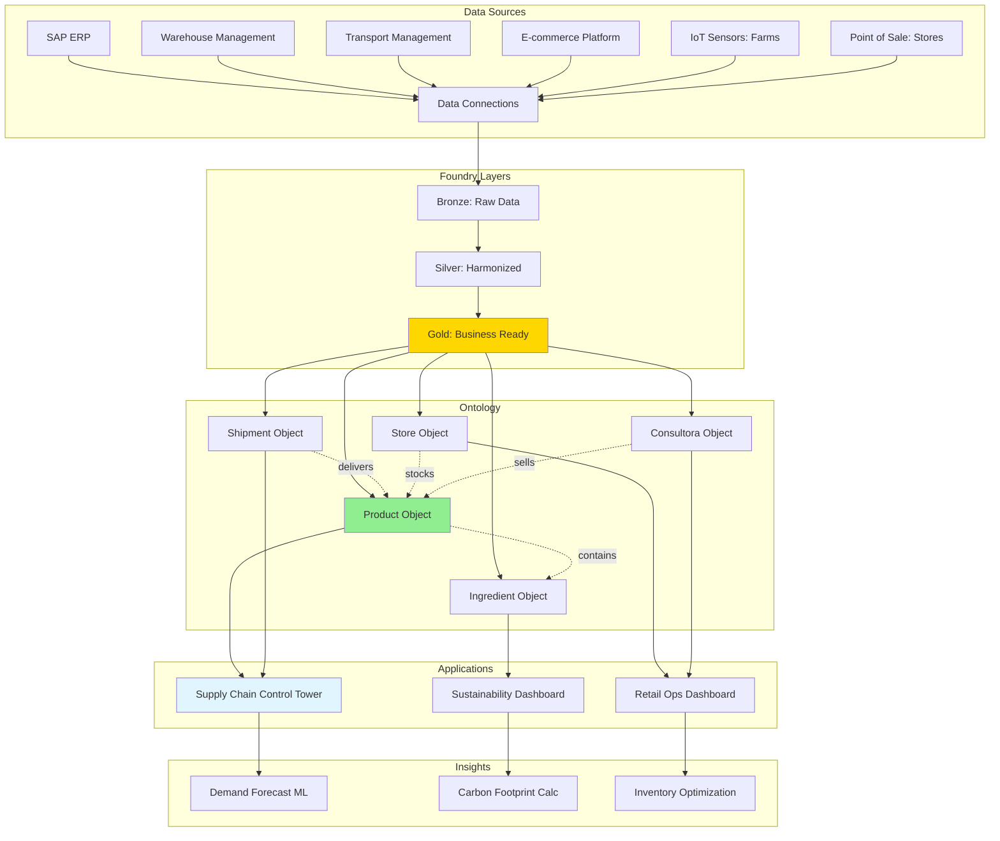
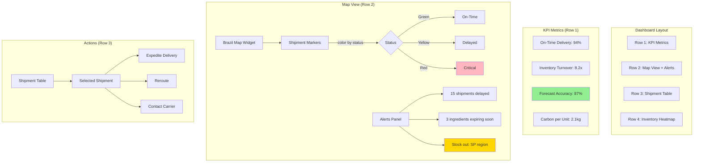
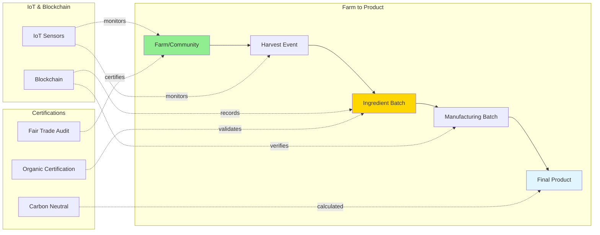
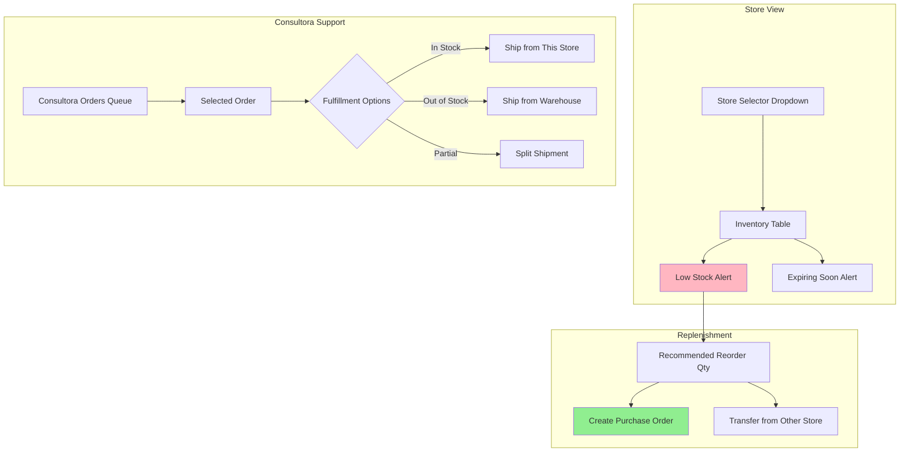
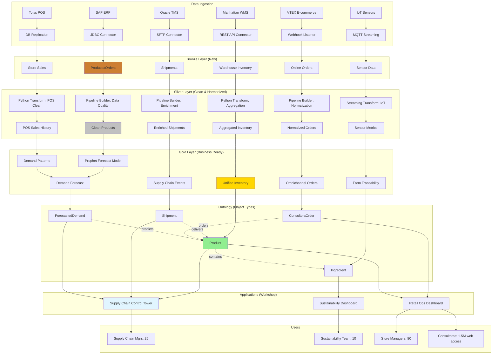

# Caso de Uso: Natura Brasil - Supply Chain e Retail Operations

## Contexto Empresarial

**Natura &Co** e um dos maiores grupos de cosmeticos do mundo, com forte presenca na America Latina. A operacao brasileira da Natura enfrenta desafios unicos:

1. **Modelo de vendas diretas**: 1.5M+ consultoras Natura em todo Brasil
2. **Supply chain complexa**: Biodiversidade da Amazonia, sustentabilidade, rastreabilidade
3. **Retail omnichannel**: Lojas fisicas + e-commerce + vendas diretas
4. **ESG Compliance**: Metas ambientais rigorosas, certificacoes sustentaveis

A Natura implementou Palantir Foundry para criar uma **single source of truth** integrando supply chain, retail operations e sustainability metrics.

## Desafios Pre-Foundry

### Supply Chain Fragmentado
- **20+ sistemas legados** sem integracao (ERP, WMS, TMS, Procurement)
- **Visibilidade limitada**: Nao sabia onde produtos estavam em tempo real
- **Forecast inexato**: Baseado em planilhas Excel, erro de 30-40%
- **Waste alto**: 12% de produtos venciam em CD sem serem vendidos

### Rastreabilidade Sustentavel Insuficiente
- **Ingredientes da Amazonia**: Dificil rastrear origem (compliance com regulacoes)
- **Certificacoes manuais**: Fair trade, organico, carbono neutro (processo demorado)
- **Relatorios ESG**: Dados coletados manualmente, auditoria demorava meses

### Retail Operations Siloed
- **Inventory mismatch**: E-commerce nao sabia stock de lojas fisicas
- **Consultora experience ruim**: Pedidos demoravam 7-10 dias para entregar
- **Promocoes descoordenadas**: Marketing lanava campanhas sem visibilidade de inventory

## Solucao Foundry

### Arquitetura Geral



### 1. Supply Chain Optimization

#### Control Tower Architecture

**Objetivo:** Visibilidade end-to-end de materia-prima ate entrega final.

**Ontology Objects Criados:**

```typescript
// Product Object Type
interface Product {
    productId: string;           // Primary key
    productName: string;         // Title
    category: string;            // Face, Body, Fragrance
    ingredients: Array<Ingredient>; // Link to Ingredient objects
    carbonFootprint: number;     // Calculated property
    inStock: number;             // Aggregated from warehouses
    forecastDemand: number;      // ML prediction
    sustainabilityCertifications: Array<string>;
}

// Shipment Object Type
interface Shipment {
    shipmentId: string;
    origin: Location;
    destination: Location;
    products: Array<Product>;    // Link to Product objects
    status: "IN_TRANSIT" | "DELIVERED" | "DELAYED";
    estimatedDelivery: Date;
    actualDelivery: Date;
    carrier: string;
    temperature: number;         // IoT sensor data
}

// Ingredient Object Type
interface Ingredient {
    ingredientId: string;
    name: string;
    source: "AMAZONIA" | "CULTIVATED" | "SYNTHETIC";
    farm: Farm;                  // Link to Farm object
    certifications: Array<Certification>;
    harvestDate: Date;
    expirationDate: Date;
    traceabilityCode: string;    // Blockchain hash
}
```

#### Pipeline: Demand Forecasting

```python
# Silver Layer: Historical sales aggregation
@transform(
    output=Output("/Natura/Silver/Sales_Aggregated"),
    sales=Input("/Natura/Bronze/POS_Sales"),
    consultora_sales=Input("/Natura/Bronze/Consultora_Orders")
)
def aggregate_sales(sales, consultora_sales):
    combined = sales.union(consultora_sales)

    return (combined
        .groupBy("product_id", "region", "week")
        .agg(
            sum("quantity").alias("total_sold"),
            avg("unit_price").alias("avg_price"),
            count("transaction_id").alias("num_transactions")
        )
        .withColumn("seasonality_factor",
            when(col("week").isin(48, 49, 50), 2.5)  # Black Friday, Natal
            .when(col("week").isin(19, 20), 1.8)      # Dia das Maes
            .otherwise(1.0))
    )

# Gold Layer: ML Forecast
@transform(
    output=Output("/Natura/Gold/Demand_Forecast"),
    historical=Input("/Natura/Silver/Sales_Aggregated"),
    promotions=Input("/Natura/Reference/Marketing_Calendar")
)
def forecast_demand(historical, promotions):
    # Prophet model para time series forecasting
    from fbprophet import Prophet

    # Prepare data por produto
    forecasts = []
    for product in historical.select("product_id").distinct().collect():
        product_data = historical.filter(col("product_id") == product.product_id)

        # Train Prophet model
        model = Prophet(seasonality_mode='multiplicative')
        model.add_country_holidays(country_name='BR')
        model.fit(product_data)

        # Forecast next 12 weeks
        future = model.make_future_dataframe(periods=12, freq='W')
        forecast = model.predict(future)

        forecasts.append(forecast)

    return spark.createDataFrame(forecasts)
```

#### Workshop: Supply Chain Control Tower



**Key Widgets:**

1. **Metric Cards**: KPIs calculados em tempo real de object sets
2. **Map Widget**: Geolocation de shipments com drill-down
3. **Filter List**: Por regiao, status, carrier, tipo de produto
4. **Object Table**: Shipments com colunas customizadas
5. **Quiver Chart (embedded)**: Forecast vs actual demand

**TypeScript Functions:**

```typescript
// Helper function: Calculate delivery delay
@Function()
public calculateDelay(
    shipment: Shipment
): DelaySummary {
    const estimated = shipment.estimatedDelivery.getTime();
    const actual = shipment.actualDelivery?.getTime() || Date.now();
    const delayHours = (actual - estimated) / (1000 * 60 * 60);

    return {
        delayHours: delayHours,
        severity: delayHours < 24 ? "LOW" :
                  delayHours < 72 ? "MEDIUM" : "HIGH",
        impactedOrders: shipment.products.length,
        estimatedCost: delayHours * 150 // R$ per hour
    };
}

// Action: Expedite Shipment
@Edits(Shipment)
@OntologyEditFunction()
public expediteShipment(
    shipment: Shipment,
    reason: string,
    approver: string
): void {
    shipment.priority = "URGENT";
    shipment.expediteReason = reason;
    shipment.expediteApprovedBy = approver;
    shipment.expediteDate = new Date();

    // Webhook to TMS to upgrade shipping tier
    // (configured in Data Connection)
}
```

**Resultados:**
- On-time delivery: 78% → 94%
- Forecast accuracy: 55% → 87%
- Inventory holding cost: -35%
- Waste (expiration): 12% → 3%

### 2. Sustainability Tracking

#### Rastreabilidade de Ingredientes da Amazonia

**Problema:** Natura usa ingredientes nativos (acai, cupuacu, castanha-do-para) e precisa provar origem sustentavel para certificacoes.

**Solucao:** Ontology com rastreabilidade end-to-end.



**Pipeline: Carbon Footprint Calculation**

```python
@transform(
    output=Output("/Natura/Gold/Product_Carbon_Footprint"),
    products=Input("/Natura/Silver/Products_Clean"),
    ingredients=Input("/Natura/Gold/Ingredients_Sourced"),
    transport=Input("/Natura/Silver/Shipments_Clean")
)
def calculate_carbon_footprint(products, ingredients, transport):
    # Join product → ingredients → transport
    product_ingredients = products.join(
        ingredients,
        products.ingredient_ids.contains(ingredients.ingredient_id)
    )

    # Carbon from sourcing
    carbon_sourcing = (product_ingredients
        .groupBy("product_id")
        .agg(sum("ingredient_carbon_kg").alias("sourcing_carbon"))
    )

    # Carbon from transport
    carbon_transport = (transport
        .groupBy("product_id")
        .agg(
            sum(col("distance_km") * col("emission_factor")).alias("transport_carbon")
        )
    )

    # Carbon from manufacturing (fixed per category)
    carbon_mfg = products.withColumn("mfg_carbon",
        when(col("category") == "Fragrance", 0.8)
        .when(col("category") == "Face", 0.5)
        .otherwise(0.3)
    )

    # Total carbon
    return (carbon_mfg
        .join(carbon_sourcing, "product_id")
        .join(carbon_transport, "product_id")
        .withColumn("total_carbon_kg",
            col("sourcing_carbon") + col("transport_carbon") + col("mfg_carbon"))
    )
```

**Workshop: Sustainability Dashboard**

**Object Table: Products com Carbon Footprint**
- Filtros: Above/below target, category, certification status
- Sort: By carbon footprint descending
- Color coding: Green (<2kg), Yellow (2-3kg), Red (>3kg)

**Quiver Embedded Charts:**
1. **Time Series**: Carbon emissions trend over time
2. **Bar Chart**: Carbon breakdown por categoria
3. **Pie Chart**: Proportion de ingredientes por fonte (Amazonia, Cultivated, Synthetic)

**Action: Request Certification Audit**
```typescript
@Edits(Ingredient, AuditRequest)
@OntologyEditFunction()
public requestCertificationAudit(
    ingredient: Ingredient,
    certificationType: "ORGANIC" | "FAIR_TRADE" | "RAINFOREST_ALLIANCE",
    urgency: "ROUTINE" | "URGENT"
): void {
    const audit = Objects.create.auditRequest(Uuid.random());
    audit.ingredientId = ingredient.ingredientId;
    audit.farmId = ingredient.farm.id;
    audit.certificationType = certificationType;
    audit.requestDate = new Date();
    audit.status = "PENDING";
    audit.urgency = urgency;

    // Notification to certification body via email
    // (configured in Action notification settings)
}
```

**Resultados:**
- Tempo de certificacao: 6 meses → 2 meses
- Audit trail completo: 100% rastreabilidade
- Carbon reduction: 18% YoY
- ESG reporting: Manual (3 meses) → Automatico (1 dia)

### 3. Retail Operations Integration

#### Omnichannel Inventory

**Problema:** Cliente no e-commerce nao podia comprar produto disponivel em loja fisica proxima.

**Solucao:** Unified inventory view com ship-from-store capability.

**Ontology:**

```typescript
interface Store {
    storeId: string;
    storeName: string;
    location: GeoPoint;
    inventory: Array<ProductInventory>;
    operatingHours: string;
    storeType: "FLAGSHIP" | "STANDARD" | "KIOSK";
}

interface ProductInventory {
    product: Product;
    quantityAvailable: number;
    reservedForOrders: number;
    lastUpdated: Timestamp;
    reorderPoint: number;
}

interface ConsultoraOrder {
    orderId: string;
    consultora: Consultora;
    products: Array<OrderLine>;
    deliveryAddress: Address;
    preferredDeliveryDate: Date;
    status: "PENDING" | "CONFIRMED" | "SHIPPED" | "DELIVERED";
}
```

**Pipeline: Real-time Inventory Sync**

```python
# Incremental processing: only updated inventory
@incremental()
@transform(
    output=Output("/Natura/Gold/Unified_Inventory"),
    store_inv=Input("/Natura/Bronze/Store_POS_Inventory"),
    warehouse_inv=Input("/Natura/Bronze/WMS_Inventory"),
    reserved=Input("/Natura/Silver/Reserved_Orders")
)
def unify_inventory(store_inv, warehouse_inv, reserved):
    # Combine all inventory sources
    all_inventory = (store_inv
        .union(warehouse_inv)
        .groupBy("product_id", "location_id")
        .agg(sum("quantity").alias("total_available"))
    )

    # Subtract reserved quantities
    available = (all_inventory
        .join(reserved, ["product_id", "location_id"], "left")
        .withColumn("net_available",
            col("total_available") - coalesce(col("reserved_qty"), lit(0)))
    )

    return available
```

**Workshop: Store Manager Dashboard**



**AIP Logic: Intelligent Fulfillment**

```typescript
@Function()
public optimizeFulfillment(
    order: ConsultoraOrder,
    customerLocation: GeoPoint
): FulfillmentPlan {
    // AIP Logic Use AI Block
    // System Prompt: "You are a supply chain optimization expert..."
    // Tools:
    //   - Query Objects: Get nearby stores with inventory
    //   - Calculator: Calculate shipping cost + time
    //   - Function: Check carbon footprint of each option
    //
    // Task Prompt:
    // "Given order `{{order}}` and customer at `{{customerLocation}}`,
    //  recommend optimal fulfillment considering:
    //  1. Delivery speed
    //  2. Cost efficiency
    //  3. Carbon footprint
    //  4. Inventory availability"
    //
    // Output: Structured FulfillmentPlan

    return {
        recommendedSource: "STORE_SAO_PAULO_03",
        estimatedDelivery: "2024-11-20",
        totalCost: 18.50,
        carbonKg: 1.2,
        confidence: 0.92,
        alternatives: [
            { source: "WAREHOUSE_SP", cost: 15.00, days: 5, carbon: 2.1 },
            { source: "STORE_SAO_PAULO_07", cost: 20.00, days: 1, carbon: 0.8 }
        ]
    };
}
```

**Resultados:**
- Consultora order fulfillment: 7-10 dias → 2-3 dias
- Ship-from-store adoption: 0% → 35% de orders
- Inventory turnover: 6.5x → 8.2x
- Customer satisfaction (NPS): 72 → 86

## Integracao de Sistemas

| Sistema | Metodo de Integracao | Frequencia | Dados |
|---------|---------------------|------------|-------|
| **SAP ERP** | JDBC connector | 1h incremental | Products, orders, inventory |
| **WMS (Manhattan)** | REST API | 15min | Warehouse stock, shipments |
| **TMS (Oracle)** | SFTP + CSV | 30min | In-transit shipments, carrier data |
| **E-commerce (VTEX)** | Webhook | Real-time | Online orders, cart events |
| **POS (Totvs)** | Database replication | 5min | Store sales, inventory |
| **IoT Platform** | MQTT streaming | Real-time | Farm sensors, cold chain temp |

## Metricas Consolidadas

| KPI | Antes | Depois | Melhoria |
|-----|-------|--------|----------|
| **On-Time Delivery** | 78% | 94% | +21% |
| **Forecast Accuracy** | 55% | 87% | +58% |
| **Inventory Waste** | 12% | 3% | -75% |
| **Carbon Footprint/Unit** | 2.9kg | 2.1kg | -28% |
| **ESG Reporting Time** | 3 meses | 1 dia | -99% |
| **Consultora Order Time** | 7-10 dias | 2-3 dias | -70% |
| **Ship-from-Store %** | 0% | 35% | +35pp |
| **NPS Score** | 72 | 86 | +19% |
| **Inventory Holding Cost** | - | -35% | -35% |

## Arquitetura Tecnica Completa



## Proximos Passos (Roadmap 2025-2026)

### Q1 2025: Event Streaming
- Migrar de batch para streaming completo
- Latencia: 5min → 5seg para inventory updates
- Kafka integration para real-time order processing

### Q2 2025: Advanced Analytics
- Predictive maintenance para manufacturing equipment
- Customer churn prediction para consultoras
- Price optimization com dynamic pricing

### Q3 2025: AIP Expansion
- RAG para product recommendation chatbot
- Consultora virtual assistant (WhatsApp integration)
- Automated ESG report generation com IA

### Q4 2025: International Expansion
- Replica para operacoes Argentina, Chile, Colombia, Mexico
- Multi-currency, multi-language support
- Cross-border supply chain optimization

## Licoes Aprendidas

### Sucessos
- **Data Quality First**: Investimento em Bronze/Silver layers foi crucial
- **User Co-creation**: Workshops com usuarios finais durante desenvolvimento
- **Incremental Rollout**: Comecar com supply chain, depois sustainability, depois retail
- **Training Investment**: 20h de training por usuario, adoption alta

### Desafios
- **Legacy System Integration**: SAP customizacoes exigiram adapters complexos
- **Data Governance**: Definir "single version of truth" com stakeholders levou 6 meses
- **Performance**: Object sets com 50M+ products exigiram materializacoes
- **Change Management**: Cultura de "planilha Excel" foi dificil de mudar

## Contato

Para mais informacoes sobre implementacoes em retail e supply chain:

- [BTG Pactual Case Study](./btg-pactual.md) - Financial services
- [Banco BV Case Study](./banco-bv.md) - Digital banking
- [Overview de Casos Brasileiros](./overview.md) - Padroes e ROI

---

**Documento preparado por**: Equipe Ontologize
**Ultima atualizacao**: Novembro 2025
**Status**: Producao (desde Q3 2024)
