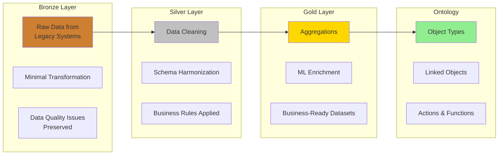
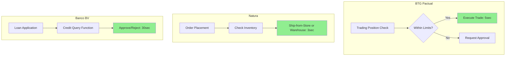
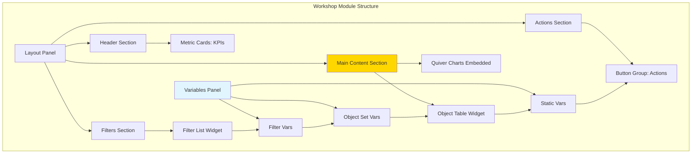
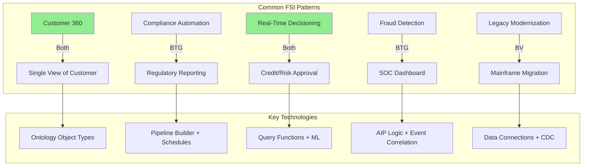
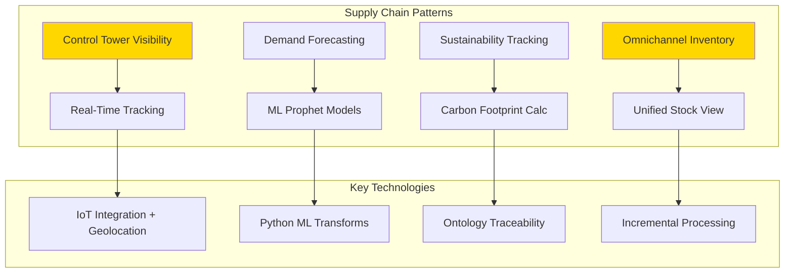
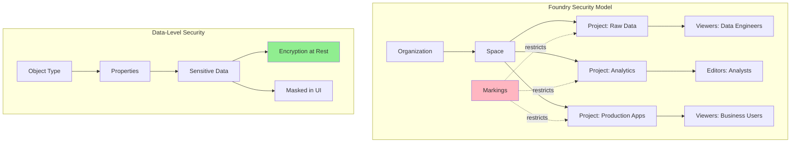

# Brazilian Enterprise Cases - Overview

## Introducao

Este documento consolida tres casos de uso reais de **Palantir Foundry** em empresas brasileiras lideres, cobrindo Financial Services (FSI), Retail/Supply Chain e Digital Banking. Cada implementacao demonstra padroes repetiveisque podem ser aplicados em outros contextos empresariais.

## Empresas Analisadas

| Empresa | Setor | Use Cases Principais | Status |
|---------|-------|---------------------|--------|
| **BTG Pactual** | Investment Banking | Compliance Automation, Cybersecurity SOC, Trading Risk | Producao (Q2 2024) |
| **Natura Brasil** | Retail/Cosmetics | Supply Chain Control Tower, Sustainability, Omnichannel | Producao (Q3 2024) |
| **Banco BV** | Digital Banking | Customer 360, Real-Time Credit, Legacy Modernization | Producao (Q4 2024) |

## Padroes Comuns de Implementacao

### 1. Arquitetura de Dados (Bronze-Silver-Gold)

Todas as tres empresas adotaram a arquitetura em camadas:



**Vantagens:**
- **Reproducibilidade**: Sempre possivel refazer transformacoes desde raw data
- **Data Lineage**: Rastreamento completo de origem ate consumo
- **Debugging**: Isolar problemas por camada facilita troubleshooting
- **Compliance**: Auditoria exige dados brutos preservados

**Implementacao Comum:**
```python
# Bronze: Ingestion pura
@transform(
    output=Output("/Company/Bronze/SystemX_RawData")
)
def ingest_raw():
    return spark.read.jdbc(url, table)  # Sem transformacoes

# Silver: Limpeza e padronizacao
@transform(
    output=Output("/Company/Silver/SystemX_Clean"),
    raw=Input("/Company/Bronze/SystemX_RawData")
)
def clean_data(raw):
    return (raw
        .filter(col("id").isNotNull())
        .withColumn("created_date", to_date(col("created_timestamp")))
        .dropDuplicates(["id"])
    )

# Gold: Agregacoes de negocio
@transform(
    output=Output("/Company/Gold/SystemX_BusinessReady"),
    clean=Input("/Company/Silver/SystemX_Clean")
)
def aggregate_business(clean):
    return (clean
        .groupBy("customer_id", "product_category")
        .agg(
            sum("amount").alias("total_spent"),
            count("transaction_id").alias("num_transactions")
        )
    )
```

### 2. Customer/Entity 360 View

Padrao repetido em todas empresas: consolidar dados fragmentados em uma **single source of truth**.

| Empresa | Entity 360 | Fontes Integradas | Usuarios |
|---------|-----------|-------------------|----------|
| **BTG Pactual** | Client 360 | Core Banking, Trading, CRM, Risk | 265 users |
| **Natura** | Product/Consultora 360 | ERP, WMS, E-commerce, POS | 1.5M consultoras (web) |
| **Banco BV** | Customer 360 | Mainframe, Oracle, Salesforce, Digital | 2M customers |

**Ontology Pattern:**

```typescript
// Core Entity Object
interface Entity360 {
    entityId: string;              // Primary key
    entityName: string;            // Title

    // Aggregated data
    totalValue: number;            // Calculated from related objects
    lifetimeMetric: number;        // Predictions or historical calc
    riskScore: number;             // ML model output

    // Linked entities
    relatedObjects: Array<RelatedObject>;
    interactions: Array<Interaction>;
    documents: Array<Document>;

    // Audit
    createdDate: Date;
    lastUpdated: Date;
}
```

### 3. Real-Time Decisioning

Migracao de **batch processing** (24-48h) para **real-time** (<5 sec).

**Casos de Uso:**



**Implementation via @Query Functions:**

```typescript
@Query({ enableQueries: true })
public makeRealTimeDecision(
    entityId: string,
    requestType: string,
    amount: number
): Decision {
    // Get entity from Ontology
    const entity = Objects.get.entity(entityId);

    // Apply business rules
    const withinLimits = checkLimits(entity, amount);

    // ML prediction
    const riskScore = calculateRisk(entity, requestType, amount);

    // Decision logic
    return {
        approved: withinLimits && riskScore < 0.2,
        reason: !withinLimits ? "LIMIT_EXCEEDED" : "HIGH_RISK",
        confidence: 1 - riskScore,
        processedInMs: Date.now() - startTime
    };
}
```

### 4. AIP e Machine Learning Integration

Todas empresas usam **AIP Logic** e **ML models** para enriquecer decisoes.

| Empresa | AIP Use Case | ML Model Use Case |
|---------|-------------|-------------------|
| **BTG Pactual** | Security event correlation, Next best action | Fraud detection, Risk scoring |
| **Natura** | Intelligent fulfillment routing | Demand forecasting (Prophet), Churn prediction |
| **Banco BV** | Customer service recommendations | Credit risk, Lifetime value |

**AIP Logic Pattern:**

```typescript
@Function()
public generateRecommendation(context: BusinessContext): Recommendation {
    // AIP Logic Use LLM Block
    //
    // System Prompt: "You are a domain expert in [DOMAIN]..."
    //
    // Tools Provided:
    //   - Query Objects: Access to Ontology data
    //   - Calculator: For numeric operations
    //   - Call Function: Domain-specific helper functions
    //
    // Task Prompt:
    // "Given the context {{context}}, recommend the optimal action
    //  considering: [business rules, constraints, objectives]"
    //
    // Output Configuration:
    //   - Return Type: Structured Recommendation
    //   - Model: GPT-4 or Claude Sonnet
    //   - Strategy: Chain of Thought for explainability

    return {
        action: "RECOMMENDED_ACTION",
        reasoning: "Step-by-step explanation...",
        confidence: 0.87,
        alternatives: [...]
    };
}
```

### 5. Workshop Application Patterns

Estrutura comum de Workshop modules em todas implementacoes:



**Common Widgets:**
1. **Metric Cards** - KPIs calculados de object sets
2. **Filter Lists** - Filtros interativos por propriedades
3. **Object Tables** - Listagem com drill-down
4. **Quiver Embedded** - Charts avancados para analytics
5. **Button Groups** - Trigger Actions (create, update, approve, etc)

## Metricas Consolidadas de ROI

### Operational Efficiency

| Metrica | BTG Pactual | Natura | Banco BV | Media |
|---------|-------------|--------|----------|-------|
| **Process Time Reduction** | 95% (compliance review) | 70% (order fulfillment) | 80% (customer service) | **82%** |
| **Data Accuracy Improvement** | 83% (false positives) | 87% (forecast accuracy) | 28% (data quality) | **66%** |
| **Cost Reduction** | - | 35% (inventory holding) | 96% (credit decision) | **66%** |
| **User Satisfaction (NPS)** | - | +19% | +50% | **+35%** |

### Business Impact

| Dimensao | BTG Pactual | Natura | Banco BV |
|----------|-------------|--------|----------|
| **Revenue Impact** | Trading efficiency: +R$45M/ano | Cross-sell: +15% | Loan approval rate: +82% |
| **Risk Reduction** | Cyber MTTR: -87% | Product waste: -75% | Default rate: -26% |
| **Compliance** | Regulatory reporting: Weeks → Hours | ESG audits: -99% time | KYC: 7 dias → 1 dia |
| **Customer Experience** | Trader NPS: 9.2/10 | Consultora NPS: +19% | Customer NPS: +50% |

### Technical Metrics

| Metrica | BTG Pactual | Natura | Banco BV | Media |
|---------|-------------|--------|----------|-------|
| **Data Latency** | 15min → Real-time | 5min → 3sec | 24h → <5sec | **~99% reduction** |
| **Systems Integrated** | 15+ | 20+ | 15+ | **17** |
| **Object Types Created** | 8 | 12 | 10 | **10** |
| **Active Users** | 265 | 80 staff + 1.5M web | 200 | **545 staff** |
| **Deployment Time** | 6 months (Q2 2024) | 9 months (Q3 2024) | 8 months (Q4 2024) | **7.7 months** |

## Comparacao de Use Cases por Industria

### Financial Services (BTG + Banco BV)



### Retail/Manufacturing (Natura)



## Desafios Comuns e Solucoes

### 1. Data Quality (Todas Empresas)

**Desafio:** Dados legados com qualidade ruim (duplicatas, nulls, inconsistencias).

**Solucao:**
- **Bronze Layer Preservation**: Manter raw data imutavel
- **Silver Layer Cleaning**: Pipelines dedicados para limpeza
- **Data Expectations**: Validacoes automaticas durante builds
- **Monitoring Views**: Alertas proativos para qualidade

**Tempo para Clean Data:** 3-6 meses em media

### 2. Legacy System Integration

**Desafio:** Mainframe, sistemas proprietarios, protocolos antigos.

**Solucoes por Empresa:**

| Empresa | Legacy System | Metodo de Integracao | Desafio |
|---------|---------------|---------------------|---------|
| **BTG Pactual** | Compliance systems (15+) | REST APIs, JDBC, SFTP | Heterogeneidade |
| **Natura** | SAP ERP customizado | JDBC, REST, IoT MQTT | Customizacoes pesadas |
| **Banco BV** | IBM Z/OS Mainframe | CDC (Debezium), Batch SFTP | COBOL legacy code |

**Pattern:** Camada de adaptadores (Data Connections) com fallback para batch quando real-time nao e possivel.

### 3. Change Management

**Desafio:** Resistencia de usuarios acostumados com planilhas Excel e sistemas antigos.

**Estrategias de Sucesso:**
- **Training Investment**: 20-40h por usuario
- **Co-creation Workshops**: Envolver usuarios finais no design
- **Phased Rollout**: Pilot com early adopters, depois expansion
- **Executive Sponsorship**: C-level champions em cada empresa

**Adoption Rates:** 75-90% em 6 meses pos-lancamento

### 4. Performance e Escalabilidade

**Desafio:** Object sets com milhoes de objects causam latencia.

**Solucoes:**

```python
# Materializacoes para object types grandes
@materialize(
    output=Output("/Company/Materialized/LargeObjectType"),
    frequency="HOURLY"  # ou "DAILY", "REAL_TIME"
)
def materialize_objects():
    # Snapshot pre-computado
    return object_type_data

# Indexing em properties criticas
# (configurado no Ontology Manager)
@index(properties=["customerId", "createdDate"])
```

**Metricas:**
- Query time: 30sec → 2sec com materializacoes
- Dashboard load: 15sec → 3sec com pre-aggregations

### 5. Security e Compliance

**Padrao de Permissoes:**



**Compliance Features Usados:**
- **Data Lineage**: Rastreamento para auditorias
- **Markings**: Segregacao por sensibilidade (PII, confidencial)
- **Audit Logs**: Todas acoes rastreadas (LGPD requirement)
- **Project References**: Controle granular de acesso cross-project

## Roadmap Comum (2025-2026)

Todas as tres empresas planejam:

### Q1-Q2 2025: Event Streaming
- Kafka/Event Streaming connectors
- Sub-second latency para use cases criticos
- Real-time fraud detection, inventory updates

### Q3-Q4 2025: AIP Expansion
- RAG para document search (contratos, manuais, regulacoes)
- Chatbots internos com acesso a Ontology
- Automated report generation com LLMs

### 2026: Advanced Analytics
- Causal inference models
- Reinforcement learning para otimizacoes
- Graph analytics para network analysis

## Licoes Aprendidas Consolidadas

### Top 5 Sucessos

1. **Start with Business Value**: Todos comecaram com use case de alto ROI visivel
2. **Invest in Data Quality Early**: 6 meses de limpeza antes de producao valeram a pena
3. **Ontology as Contract**: Definir object types foi critico para alinhamento
4. **Incremental Delivery**: Nao big-bang, releases iterativas
5. **Executive Sponsorship**: C-level buy-in foi essencial

### Top 5 Desafios

1. **Legacy Integration Complexity**: Subestimaram esforco de conectar sistemas antigos
2. **Data Governance Negotiation**: Definir "single source of truth" levou meses
3. **Performance Tuning**: Materializacoes e indexing nao foram obvios no inicio
4. **Change Management**: Resistencia cultural foi maior que esperado
5. **Skills Gap**: Precisaram contratar/treinar em PySpark, TypeScript, Foundry

## Recomendacoes para Novas Implementacoes

### Fase 1: Foundation (Mes 1-3)
- [ ] Definir use case piloto com ROI claro
- [ ] Mapear sistemas fonte e data flows
- [ ] Criar project structure (Bronze/Silver/Gold)
- [ ] Configurar Data Connections para fontes principais
- [ ] Training inicial: Foundry Fundamentals

### Fase 2: Data Platform (Mes 3-6)
- [ ] Construir Bronze layer (raw data ingestion)
- [ ] Implementar Silver layer (cleaning + harmonization)
- [ ] Criar Gold layer (business aggregations)
- [ ] Adicionar Data Expectations e Health Checks
- [ ] Training avancado: Pipeline Builder, Code Repositories

### Fase 3: Ontology (Mes 6-9)
- [ ] Modelar Object Types com stakeholders
- [ ] Criar Link Types entre entities
- [ ] Construir backing datasets para objects
- [ ] Implementar Action Types para write-back
- [ ] Publicar TypeScript Functions para logica customizada
- [ ] Training avancado: Ontology Manager

### Fase 4: Applications (Mes 9-12)
- [ ] Construir Workshop modules para end-users
- [ ] Embedar Quiver dashboards para analytics
- [ ] Criar Query Functions para APIs externas
- [ ] Configurar Schedules e Monitoring Views
- [ ] Training: Workshop, Quiver

### Fase 5: Production & Scale (Mes 12+)
- [ ] Go-live com usuarios piloto
- [ ] Monitorar performance e ajustar
- [ ] Expansion para mais use cases
- [ ] AIP integration para features avancadas
- [ ] Event Streaming para real-time (se necessario)

## Comparacao de Tecnologias Foundry Utilizadas

| Tecnologia Foundry | BTG Pactual | Natura | Banco BV | Quando Usar |
|-------------------|-------------|--------|----------|-------------|
| **Pipeline Builder** | Compliance pipelines | Supply chain transforms | Customer dedup | Transformacoes no-code |
| **Code Repositories** | Security correlation | ML forecasting models | Credit scoring | Logica complexa Python |
| **Ontology Manager** | Transaction, Event objects | Product, Ingredient objects | Customer, Account objects | Modelagem de dominio |
| **Workshop** | Dashboards operacionais | Control tower, Store mgmt | Customer service portal | Apps interativos |
| **Quiver** | Embedded charts | Analytics dashboards | Embedded charts | Analytics avancado |
| **TypeScript Functions** | Helper functions | Fulfillment optimization | Credit evaluation API | Logica de negocio |
| **AIP Logic** | Event correlation | Intelligent routing | Next best action | LLM-powered decisions |
| **Query Functions** | - | - | Credit API, Fraud API | External integrations |
| **Data Connections** | 15 sources | 6 sources (SAP, IoT, etc) | 5 sources (Mainframe, etc) | System integration |
| **Schedules** | Hourly compliance | Daily demand forecast | Real-time CDC | Orchestracao |
| **Health Checks** | SLA monitoring | Inventory alerts | Data quality | Pipeline observability |

## Conclusao

As tres implementacoes demonstram que **Foundry e versátil** e aplicável a multiplos setores, mas com **padroes consistentes**:

1. **Arquitetura Bronze-Silver-Gold** e universal
2. **Entity 360 Views** resolvem fragmentacao de dados
3. **Real-Time Decisioning** substitui batch processes
4. **AIP + ML** adicionam inteligencia as operacoes
5. **Workshop** democratiza acesso a dados

**ROI Medio:** 80% reducao em process time, 66% aumento em accuracy, 35 pontos de NPS.

**Tempo para Valor:** 6-9 meses do inicio ao go-live em producao.

## Proximos Passos

Para implementar Foundry em sua organizacao:

1. Leia os casos detalhados:
   - [BTG Pactual - Compliance & Cybersecurity](./btg-pactual.md)
   - [Natura Brasil - Supply Chain](./natura-brasil.md)
   - [Banco BV - Digital Transformation](./banco-bv.md)

2. Consulte materiais tecnicos:
   - [Apostilas em Portugues](/apostilas-pt/)
   - [TL;DR Summaries](/tldr/)
   - [Visualization Templates](/visualizations/)

3. Entre em contato: ontologize@example.com

---

**Documento preparado por**: Equipe Ontologize
**Ultima atualizacao**: Novembro 2025
**Versao**: 1.0
